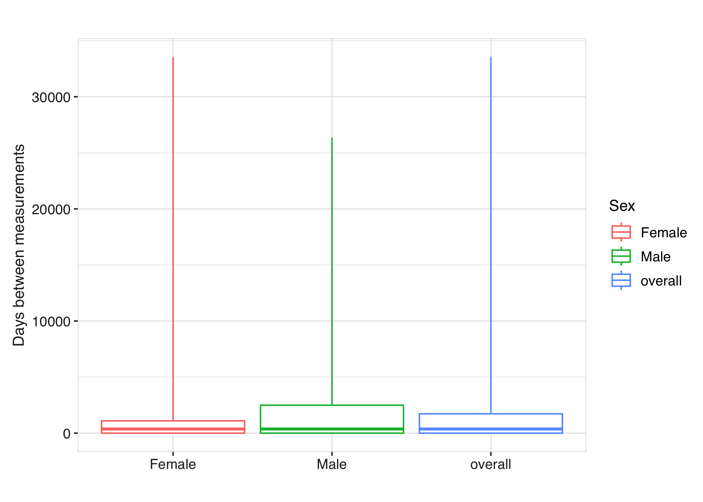

<!-- README.md is generated from README.Rmd. Please edit that file -->

<!-- README.md is generated from README.Rmd. Please edit that file -->

# MeasurementDiagnostics 

<!-- badges: start -->

[](https://CRAN.R-project.org/package=MeasurementDiagnostics)
[](https://github.com/OHDSI/MeasurementDiagnostics/actions/workflows/R-CMD-check.yaml)
[](https://app.codecov.io/gh/OHDSI/MeasurementDiagnostics)
[](https://lifecycle.r-lib.org/articles/stages.html#experimental)

<!-- badges: end -->

The MeasurementDiagnostics package provides tools to assess how
measurements are recorded and used in data mapped to the OMOP Common
Data Model.

Diagnostics can be run either on the full dataset or restricted to a
specific cohort, helping users better understand data completeness,
frequency, and value distributions for measurements of interest.

## Installation

The package can be installed from CRAN:

``` r
install.packages("MeasurementDiagnostics")
```

Or you can install the development version of the package from GitHub:

``` r
# install.packages("devtools")
devtools::install_github("ohdsi/MeasurementDiagnostics")
```

## Example

Suppose you are conducting a study that relies on measurements of
respiratory function. Before using these measurements analytically, you
may want to understand how frequently they are recorded, how values are
stored, and whether they vary across subgroups. MeasurementDiagnostics
can be used to explore these aspects.

For this example we’ll use the GiBleed mock data.

``` r
library(omock)
library(MeasurementDiagnostics)
library(OmopViewer)
library(omopgenerics)
```

``` r
cdm <- mockCdmFromDataset(datasetName = "GiBleed")
#> ℹ Reading GiBleed tables.
#> ℹ Adding drug_strength table.
#> ℹ Creating local <cdm_reference> object.
cdm
#> 
#> ── # OMOP CDM reference (local) of GiBleed ─────────────────────────────────────
#> • omop tables: care_site, cdm_source, concept, concept_ancestor, concept_class,
#> concept_relationship, concept_synonym, condition_era, condition_occurrence,
#> cost, death, device_exposure, domain, dose_era, drug_era, drug_exposure,
#> drug_strength, fact_relationship, location, measurement, metadata, note,
#> note_nlp, observation, observation_period, payer_plan_period, person,
#> procedure_occurrence, provider, relationship, source_to_concept_map, specimen,
#> visit_detail, visit_occurrence, vocabulary
#> • cohort tables: -
#> • achilles tables: -
#> • other tables: -
```

Now we have a cdm reference with our data, we will create a codelist
with measurement concepts.

``` r
respiratory_function_codes <- list("respiratory_function" = c(4052083L, 4133840L, 3011505L))
```

And now we can run all measurement diagnostic checks, stratifying
results by sex.

``` r
respiratory_function_measurements <- summariseMeasurementUse(
  cdm = cdm, codes = respiratory_function_codes, bySex = TRUE
)
```

The results include three main components:

1)  A summary of measurement use, including the number of subjects with
    measurements, the number of measurements per subject, and the time
    between measurements.

2)  A summary of measurement values recorded as numeric.

3)  A summary of measurement values recorded using concepts.

### Visualise results: Tables

Tabular summaries can be produced using the corresponding table
functions. For example, the following tables display summaries of
numeric values and concept-based values:

``` r
tableMeasurementValueAsConcept(
  respiratory_function_measurements,
  hide = c("cdm_name", "domain_id", "value_as_concept_id")
)
```

<div id="noimttsrhs" style="padding-left:0px;padding-right:0px;padding-top:10px;padding-bottom:10px;overflow-x:auto;overflow-y:auto;width:auto;height:auto;">
<style>#noimttsrhs table {
  font-family: system-ui, 'Segoe UI', Roboto, Helvetica, Arial, sans-serif, 'Apple Color Emoji', 'Segoe UI Emoji', 'Segoe UI Symbol', 'Noto Color Emoji';
  -webkit-font-smoothing: antialiased;
  -moz-osx-font-smoothing: grayscale;
}
&#10;#noimttsrhs thead, #noimttsrhs tbody, #noimttsrhs tfoot, #noimttsrhs tr, #noimttsrhs td, #noimttsrhs th {
  border-style: none;
}
&#10;#noimttsrhs p {
  margin: 0;
  padding: 0;
}
&#10;#noimttsrhs .gt_table {
  display: table;
  border-collapse: collapse;
  line-height: normal;
  margin-left: auto;
  margin-right: auto;
  color: #333333;
  font-size: 16px;
  font-weight: normal;
  font-style: normal;
  background-color: #FFFFFF;
  width: auto;
  border-top-style: solid;
  border-top-width: 3px;
  border-top-color: #D9D9D9;
  border-right-style: solid;
  border-right-width: 3px;
  border-right-color: #D9D9D9;
  border-bottom-style: solid;
  border-bottom-width: 3px;
  border-bottom-color: #D9D9D9;
  border-left-style: solid;
  border-left-width: 3px;
  border-left-color: #D9D9D9;
}
&#10;#noimttsrhs .gt_caption {
  padding-top: 4px;
  padding-bottom: 4px;
}
&#10;#noimttsrhs .gt_title {
  color: #333333;
  font-size: 125%;
  font-weight: initial;
  padding-top: 4px;
  padding-bottom: 4px;
  padding-left: 5px;
  padding-right: 5px;
  border-bottom-color: #FFFFFF;
  border-bottom-width: 0;
}
&#10;#noimttsrhs .gt_subtitle {
  color: #333333;
  font-size: 85%;
  font-weight: initial;
  padding-top: 3px;
  padding-bottom: 5px;
  padding-left: 5px;
  padding-right: 5px;
  border-top-color: #FFFFFF;
  border-top-width: 0;
}
&#10;#noimttsrhs .gt_heading {
  background-color: #FFFFFF;
  text-align: center;
  border-bottom-color: #FFFFFF;
  border-left-style: none;
  border-left-width: 1px;
  border-left-color: #D3D3D3;
  border-right-style: none;
  border-right-width: 1px;
  border-right-color: #D3D3D3;
}
&#10;#noimttsrhs .gt_bottom_border {
  border-bottom-style: solid;
  border-bottom-width: 2px;
  border-bottom-color: #D3D3D3;
}
&#10;#noimttsrhs .gt_col_headings {
  border-top-style: solid;
  border-top-width: 2px;
  border-top-color: #D3D3D3;
  border-bottom-style: solid;
  border-bottom-width: 2px;
  border-bottom-color: #D3D3D3;
  border-left-style: none;
  border-left-width: 1px;
  border-left-color: #D3D3D3;
  border-right-style: none;
  border-right-width: 1px;
  border-right-color: #D3D3D3;
}
&#10;#noimttsrhs .gt_col_heading {
  color: #333333;
  background-color: #FFFFFF;
  font-size: 100%;
  font-weight: normal;
  text-transform: inherit;
  border-left-style: none;
  border-left-width: 1px;
  border-left-color: #D3D3D3;
  border-right-style: none;
  border-right-width: 1px;
  border-right-color: #D3D3D3;
  vertical-align: bottom;
  padding-top: 5px;
  padding-bottom: 6px;
  padding-left: 5px;
  padding-right: 5px;
  overflow-x: hidden;
}
&#10;#noimttsrhs .gt_column_spanner_outer {
  color: #333333;
  background-color: #FFFFFF;
  font-size: 100%;
  font-weight: normal;
  text-transform: inherit;
  padding-top: 0;
  padding-bottom: 0;
  padding-left: 4px;
  padding-right: 4px;
}
&#10;#noimttsrhs .gt_column_spanner_outer:first-child {
  padding-left: 0;
}
&#10;#noimttsrhs .gt_column_spanner_outer:last-child {
  padding-right: 0;
}
&#10;#noimttsrhs .gt_column_spanner {
  border-bottom-style: solid;
  border-bottom-width: 2px;
  border-bottom-color: #D3D3D3;
  vertical-align: bottom;
  padding-top: 5px;
  padding-bottom: 5px;
  overflow-x: hidden;
  display: inline-block;
  width: 100%;
}
&#10;#noimttsrhs .gt_spanner_row {
  border-bottom-style: hidden;
}
&#10;#noimttsrhs .gt_group_heading {
  padding-top: 8px;
  padding-bottom: 8px;
  padding-left: 5px;
  padding-right: 5px;
  color: #333333;
  background-color: #FFFFFF;
  font-size: 100%;
  font-weight: initial;
  text-transform: inherit;
  border-top-style: solid;
  border-top-width: 2px;
  border-top-color: #D3D3D3;
  border-bottom-style: solid;
  border-bottom-width: 2px;
  border-bottom-color: #D3D3D3;
  border-left-style: none;
  border-left-width: 1px;
  border-left-color: #D3D3D3;
  border-right-style: none;
  border-right-width: 1px;
  border-right-color: #D3D3D3;
  vertical-align: middle;
  text-align: left;
}
&#10;#noimttsrhs .gt_empty_group_heading {
  padding: 0.5px;
  color: #333333;
  background-color: #FFFFFF;
  font-size: 100%;
  font-weight: initial;
  border-top-style: solid;
  border-top-width: 2px;
  border-top-color: #D3D3D3;
  border-bottom-style: solid;
  border-bottom-width: 2px;
  border-bottom-color: #D3D3D3;
  vertical-align: middle;
}
&#10;#noimttsrhs .gt_from_md > :first-child {
  margin-top: 0;
}
&#10;#noimttsrhs .gt_from_md > :last-child {
  margin-bottom: 0;
}
&#10;#noimttsrhs .gt_row {
  padding-top: 8px;
  padding-bottom: 8px;
  padding-left: 5px;
  padding-right: 5px;
  margin: 10px;
  border-top-style: solid;
  border-top-width: 1px;
  border-top-color: #D3D3D3;
  border-left-style: none;
  border-left-width: 1px;
  border-left-color: #D3D3D3;
  border-right-style: none;
  border-right-width: 1px;
  border-right-color: #D3D3D3;
  vertical-align: middle;
  overflow-x: hidden;
}
&#10;#noimttsrhs .gt_stub {
  color: #333333;
  background-color: #FFFFFF;
  font-size: 100%;
  font-weight: initial;
  text-transform: inherit;
  border-right-style: solid;
  border-right-width: 2px;
  border-right-color: #D3D3D3;
  padding-left: 5px;
  padding-right: 5px;
}
&#10;#noimttsrhs .gt_stub_row_group {
  color: #333333;
  background-color: #FFFFFF;
  font-size: 100%;
  font-weight: initial;
  text-transform: inherit;
  border-right-style: solid;
  border-right-width: 2px;
  border-right-color: #D3D3D3;
  padding-left: 5px;
  padding-right: 5px;
  vertical-align: top;
}
&#10;#noimttsrhs .gt_row_group_first td {
  border-top-width: 2px;
}
&#10;#noimttsrhs .gt_row_group_first th {
  border-top-width: 2px;
}
&#10;#noimttsrhs .gt_summary_row {
  color: #333333;
  background-color: #FFFFFF;
  text-transform: inherit;
  padding-top: 8px;
  padding-bottom: 8px;
  padding-left: 5px;
  padding-right: 5px;
}
&#10;#noimttsrhs .gt_first_summary_row {
  border-top-style: solid;
  border-top-color: #D3D3D3;
}
&#10;#noimttsrhs .gt_first_summary_row.thick {
  border-top-width: 2px;
}
&#10;#noimttsrhs .gt_last_summary_row {
  padding-top: 8px;
  padding-bottom: 8px;
  padding-left: 5px;
  padding-right: 5px;
  border-bottom-style: solid;
  border-bottom-width: 2px;
  border-bottom-color: #D3D3D3;
}
&#10;#noimttsrhs .gt_grand_summary_row {
  color: #333333;
  background-color: #FFFFFF;
  text-transform: inherit;
  padding-top: 8px;
  padding-bottom: 8px;
  padding-left: 5px;
  padding-right: 5px;
}
&#10;#noimttsrhs .gt_first_grand_summary_row {
  padding-top: 8px;
  padding-bottom: 8px;
  padding-left: 5px;
  padding-right: 5px;
  border-top-style: double;
  border-top-width: 6px;
  border-top-color: #D3D3D3;
}
&#10;#noimttsrhs .gt_last_grand_summary_row_top {
  padding-top: 8px;
  padding-bottom: 8px;
  padding-left: 5px;
  padding-right: 5px;
  border-bottom-style: double;
  border-bottom-width: 6px;
  border-bottom-color: #D3D3D3;
}
&#10;#noimttsrhs .gt_striped {
  background-color: rgba(128, 128, 128, 0.05);
}
&#10;#noimttsrhs .gt_table_body {
  border-top-style: solid;
  border-top-width: 3px;
  border-top-color: #D9D9D9;
  border-bottom-style: solid;
  border-bottom-width: 2px;
  border-bottom-color: #D3D3D3;
}
&#10;#noimttsrhs .gt_footnotes {
  color: #333333;
  background-color: #FFFFFF;
  border-bottom-style: none;
  border-bottom-width: 2px;
  border-bottom-color: #D3D3D3;
  border-left-style: none;
  border-left-width: 2px;
  border-left-color: #D3D3D3;
  border-right-style: none;
  border-right-width: 2px;
  border-right-color: #D3D3D3;
}
&#10;#noimttsrhs .gt_footnote {
  margin: 0px;
  font-size: 90%;
  padding-top: 4px;
  padding-bottom: 4px;
  padding-left: 5px;
  padding-right: 5px;
}
&#10;#noimttsrhs .gt_sourcenotes {
  color: #333333;
  background-color: #FFFFFF;
  border-bottom-style: none;
  border-bottom-width: 2px;
  border-bottom-color: #D3D3D3;
  border-left-style: none;
  border-left-width: 2px;
  border-left-color: #D3D3D3;
  border-right-style: none;
  border-right-width: 2px;
  border-right-color: #D3D3D3;
}
&#10;#noimttsrhs .gt_sourcenote {
  font-size: 90%;
  padding-top: 4px;
  padding-bottom: 4px;
  padding-left: 5px;
  padding-right: 5px;
}
&#10;#noimttsrhs .gt_left {
  text-align: left;
}
&#10;#noimttsrhs .gt_center {
  text-align: center;
}
&#10;#noimttsrhs .gt_right {
  text-align: right;
  font-variant-numeric: tabular-nums;
}
&#10;#noimttsrhs .gt_font_normal {
  font-weight: normal;
}
&#10;#noimttsrhs .gt_font_bold {
  font-weight: bold;
}
&#10;#noimttsrhs .gt_font_italic {
  font-style: italic;
}
&#10;#noimttsrhs .gt_super {
  font-size: 65%;
}
&#10;#noimttsrhs .gt_footnote_marks {
  font-size: 75%;
  vertical-align: 0.4em;
  position: initial;
}
&#10;#noimttsrhs .gt_asterisk {
  font-size: 100%;
  vertical-align: 0;
}
&#10;#noimttsrhs .gt_indent_1 {
  text-indent: 5px;
}
&#10;#noimttsrhs .gt_indent_2 {
  text-indent: 10px;
}
&#10;#noimttsrhs .gt_indent_3 {
  text-indent: 15px;
}
&#10;#noimttsrhs .gt_indent_4 {
  text-indent: 20px;
}
&#10;#noimttsrhs .gt_indent_5 {
  text-indent: 25px;
}
&#10;#noimttsrhs .katex-display {
  display: inline-flex !important;
  margin-bottom: 0.75em !important;
}
&#10;#noimttsrhs div.Reactable > div.rt-table > div.rt-thead > div.rt-tr.rt-tr-group-header > div.rt-th-group:after {
  height: 0px !important;
}
</style>
<table class="gt_table" data-quarto-disable-processing="false" data-quarto-bootstrap="false">
  <thead>
    <tr class="gt_col_headings gt_spanner_row">
      <th class="gt_col_heading gt_columns_bottom_border gt_left" rowspan="2" colspan="1" style="background-color: #E1E1E1; font-family: Arial; font-size: 10; text-align: center; font-weight: bold; border-left-width: 1px; border-left-style: solid; border-left-color: #c8c8c8; border-right-width: 1px; border-right-style: solid; border-right-color: #c8c8c8; border-top-width: 1px; border-top-style: solid; border-top-color: #c8c8c8; border-bottom-width: 1px; border-bottom-style: solid; border-bottom-color: #c8c8c8;" scope="col" id="Concept-name">Concept name</th>
      <th class="gt_col_heading gt_columns_bottom_border gt_left" rowspan="2" colspan="1" style="background-color: #E1E1E1; font-family: Arial; font-size: 10; text-align: center; font-weight: bold; border-left-width: 1px; border-left-style: solid; border-left-color: #c8c8c8; border-right-width: 1px; border-right-style: solid; border-right-color: #c8c8c8; border-top-width: 1px; border-top-style: solid; border-top-color: #c8c8c8; border-bottom-width: 1px; border-bottom-style: solid; border-bottom-color: #c8c8c8;" scope="col" id="Concept-ID">Concept ID</th>
      <th class="gt_col_heading gt_columns_bottom_border gt_left" rowspan="2" colspan="1" style="background-color: #E1E1E1; font-family: Arial; font-size: 10; text-align: center; font-weight: bold; border-left-width: 1px; border-left-style: solid; border-left-color: #c8c8c8; border-right-width: 1px; border-right-style: solid; border-right-color: #c8c8c8; border-top-width: 1px; border-top-style: solid; border-top-color: #c8c8c8; border-bottom-width: 1px; border-bottom-style: solid; border-bottom-color: #c8c8c8;" scope="col" id="Source-concept-name">Source concept name</th>
      <th class="gt_col_heading gt_columns_bottom_border gt_left" rowspan="2" colspan="1" style="background-color: #E1E1E1; font-family: Arial; font-size: 10; text-align: center; font-weight: bold; border-left-width: 1px; border-left-style: solid; border-left-color: #c8c8c8; border-right-width: 1px; border-right-style: solid; border-right-color: #c8c8c8; border-top-width: 1px; border-top-style: solid; border-top-color: #c8c8c8; border-bottom-width: 1px; border-bottom-style: solid; border-bottom-color: #c8c8c8;" scope="col" id="Source-concept-ID">Source concept ID</th>
      <th class="gt_col_heading gt_columns_bottom_border gt_left" rowspan="2" colspan="1" style="background-color: #E1E1E1; font-family: Arial; font-size: 10; text-align: center; font-weight: bold; border-left-width: 1px; border-left-style: solid; border-left-color: #c8c8c8; border-right-width: 1px; border-right-style: solid; border-right-color: #c8c8c8; border-top-width: 1px; border-top-style: solid; border-top-color: #c8c8c8; border-bottom-width: 1px; border-bottom-style: solid; border-bottom-color: #c8c8c8;" scope="col" id="Variable-name">Variable name</th>
      <th class="gt_col_heading gt_columns_bottom_border gt_left" rowspan="2" colspan="1" style="background-color: #E1E1E1; font-family: Arial; font-size: 10; text-align: center; font-weight: bold; border-left-width: 1px; border-left-style: solid; border-left-color: #c8c8c8; border-right-width: 1px; border-right-style: solid; border-right-color: #c8c8c8; border-top-width: 1px; border-top-style: solid; border-top-color: #c8c8c8; border-bottom-width: 1px; border-bottom-style: solid; border-bottom-color: #c8c8c8;" scope="col" id="Value-as-concept-name">Value as concept name</th>
      <th class="gt_col_heading gt_columns_bottom_border gt_left" rowspan="2" colspan="1" style="background-color: #E1E1E1; font-family: Arial; font-size: 10; text-align: center; font-weight: bold; border-left-width: 1px; border-left-style: solid; border-left-color: #c8c8c8; border-right-width: 1px; border-right-style: solid; border-right-color: #c8c8c8; border-top-width: 1px; border-top-style: solid; border-top-color: #c8c8c8; border-bottom-width: 1px; border-bottom-style: solid; border-bottom-color: #c8c8c8;" scope="col" id="Estimate-name">Estimate name</th>
      <th class="gt_center gt_columns_top_border gt_column_spanner_outer" rowspan="1" colspan="3" style="background-color: #D9D9D9; font-family: Arial; font-size: 10; text-align: center; font-weight: bold; border-left-width: 1px; border-left-style: solid; border-left-color: #c8c8c8; border-right-width: 1px; border-right-style: solid; border-right-color: #c8c8c8; border-top-width: 1px; border-top-style: solid; border-top-color: #c8c8c8; border-bottom-width: 1px; border-bottom-style: solid; border-bottom-color: #c8c8c8;" scope="colgroup" id="spanner-[header_name]Sex&#10;[header_level]overall">
        <div class="gt_column_spanner">Sex</div>
      </th>
    </tr>
    <tr class="gt_col_headings">
      <th class="gt_col_heading gt_columns_bottom_border gt_right" rowspan="1" colspan="1" style="background-color: #E1E1E1; font-family: Arial; font-size: 10; text-align: center; font-weight: bold; border-left-width: 1px; border-left-style: solid; border-left-color: #c8c8c8; border-right-width: 1px; border-right-style: solid; border-right-color: #c8c8c8; border-top-width: 1px; border-top-style: solid; border-top-color: #c8c8c8; border-bottom-width: 1px; border-bottom-style: solid; border-bottom-color: #c8c8c8;" scope="col" id="[header_name]Sex-[header_level]overall">overall</th>
      <th class="gt_col_heading gt_columns_bottom_border gt_right" rowspan="1" colspan="1" style="background-color: #E1E1E1; font-family: Arial; font-size: 10; text-align: center; font-weight: bold; border-left-width: 1px; border-left-style: solid; border-left-color: #c8c8c8; border-right-width: 1px; border-right-style: solid; border-right-color: #c8c8c8; border-top-width: 1px; border-top-style: solid; border-top-color: #c8c8c8; border-bottom-width: 1px; border-bottom-style: solid; border-bottom-color: #c8c8c8;" scope="col" id="[header_name]Sex-[header_level]Female">Female</th>
      <th class="gt_col_heading gt_columns_bottom_border gt_right" rowspan="1" colspan="1" style="background-color: #E1E1E1; font-family: Arial; font-size: 10; text-align: center; font-weight: bold; border-left-width: 1px; border-left-style: solid; border-left-color: #c8c8c8; border-right-width: 1px; border-right-style: solid; border-right-color: #c8c8c8; border-top-width: 1px; border-top-style: solid; border-top-color: #c8c8c8; border-bottom-width: 1px; border-bottom-style: solid; border-bottom-color: #c8c8c8;" scope="col" id="[header_name]Sex-[header_level]Male">Male</th>
    </tr>
  </thead>
  <tbody class="gt_table_body">
    <tr class="gt_group_heading_row">
      <th colspan="10" class="gt_group_heading" style="background-color: #E9E9E9; font-family: Arial; font-size: 10; font-weight: bold; border-left-width: 1px; border-left-style: solid; border-left-color: #c8c8c8; border-right-width: 1px; border-right-style: solid; border-right-color: #c8c8c8; border-top-width: 1px; border-top-style: solid; border-top-color: #c8c8c8; border-bottom-width: 1px; border-bottom-style: solid; border-bottom-color: #c8c8c8;" scope="colgroup" id="respiratory_function">respiratory_function</th>
    </tr>
    <tr class="gt_row_group_first"><td headers="respiratory_function  Concept name" class="gt_row gt_left" style="text-align: left; font-family: Arial; font-size: 10; border-left-width: 1px; border-left-style: solid; border-left-color: #c8c8c8; border-right-width: 1px; border-right-style: solid; border-right-color: #c8c8c8; border-top-width: 1px; border-top-style: solid; border-top-color: #c8c8c8; border-bottom-width: 1px; border-bottom-style: solid; border-bottom-color: #c8c8c8; background-color: rgba(255,255,255,0);">overall</td>
<td headers="respiratory_function  Concept ID" class="gt_row gt_left" style="text-align: left; font-family: Arial; font-size: 10; border-left-width: 1px; border-left-style: solid; border-left-color: #c8c8c8; border-right-width: 1px; border-right-style: solid; border-right-color: #c8c8c8; border-top-width: 1px; border-top-style: solid; border-top-color: #c8c8c8; border-bottom-width: 1px; border-bottom-style: solid; border-bottom-color: #c8c8c8; background-color: rgba(255,255,255,0);">overall</td>
<td headers="respiratory_function  Source concept name" class="gt_row gt_left" style="text-align: left; font-family: Arial; font-size: 10; border-left-width: 1px; border-left-style: solid; border-left-color: #c8c8c8; border-right-width: 1px; border-right-style: solid; border-right-color: #c8c8c8; border-top-width: 1px; border-top-style: solid; border-top-color: #c8c8c8; border-bottom-width: 1px; border-bottom-style: solid; border-bottom-color: #c8c8c8; background-color: rgba(255,255,255,0);">overall</td>
<td headers="respiratory_function  Source concept ID" class="gt_row gt_left" style="text-align: left; font-family: Arial; font-size: 10; border-left-width: 1px; border-left-style: solid; border-left-color: #c8c8c8; border-right-width: 1px; border-right-style: solid; border-right-color: #c8c8c8; border-top-width: 1px; border-top-style: solid; border-top-color: #c8c8c8; border-bottom-width: 1px; border-bottom-style: solid; border-bottom-color: #c8c8c8; background-color: rgba(255,255,255,0);">overall</td>
<td headers="respiratory_function  Variable name" class="gt_row gt_left" style="text-align: left; font-family: Arial; font-size: 10; border-left-width: 1px; border-left-style: solid; border-left-color: #c8c8c8; border-right-width: 1px; border-right-style: solid; border-right-color: #c8c8c8; border-top-width: 1px; border-top-style: solid; border-top-color: #c8c8c8; border-bottom-width: 1px; border-bottom-style: solid; border-bottom-color: #c8c8c8; background-color: rgba(255,255,255,0);">measurement_records</td>
<td headers="respiratory_function  Value as concept name" class="gt_row gt_left" style="text-align: left; font-family: Arial; font-size: 10; border-left-width: 1px; border-left-style: solid; border-left-color: #c8c8c8; border-right-width: 1px; border-right-style: solid; border-right-color: #c8c8c8; border-top-width: 1px; border-top-style: solid; border-top-color: #c8c8c8; border-bottom-width: 1px; border-bottom-style: solid; border-bottom-color: #c8c8c8; background-color: rgba(255,255,255,0);">No matching concept</td>
<td headers="respiratory_function  Estimate name" class="gt_row gt_left" style="text-align: left; font-family: Arial; font-size: 10; border-left-width: 1px; border-left-style: solid; border-left-color: #c8c8c8; border-right-width: 1px; border-right-style: solid; border-right-color: #c8c8c8; border-top-width: 1px; border-top-style: solid; border-top-color: #c8c8c8; border-bottom-width: 1px; border-bottom-style: solid; border-bottom-color: #c8c8c8; background-color: rgba(255,255,255,0);">N (%)</td>
<td headers="respiratory_function  [header_name]Sex
[header_level]overall" class="gt_row gt_right" style="text-align: right; font-family: Arial; font-size: 10; border-left-width: 1px; border-left-style: solid; border-left-color: #c8c8c8; border-right-width: 1px; border-right-style: solid; border-right-color: #c8c8c8; border-top-width: 1px; border-top-style: solid; border-top-color: #c8c8c8; border-bottom-width: 1px; border-bottom-style: solid; border-bottom-color: #c8c8c8; background-color: rgba(255,255,255,0);">8,728 (100.00%)</td>
<td headers="respiratory_function  [header_name]Sex
[header_level]Female" class="gt_row gt_right" style="text-align: right; font-family: Arial; font-size: 10; border-left-width: 1px; border-left-style: solid; border-left-color: #c8c8c8; border-right-width: 1px; border-right-style: solid; border-right-color: #c8c8c8; border-top-width: 1px; border-top-style: solid; border-top-color: #c8c8c8; border-bottom-width: 1px; border-bottom-style: solid; border-bottom-color: #c8c8c8; background-color: rgba(255,255,255,0);">4,807 (100.00%)</td>
<td headers="respiratory_function  [header_name]Sex
[header_level]Male" class="gt_row gt_right" style="text-align: right; font-family: Arial; font-size: 10; background-color: rgba(255,255,255,0); border-left-width: 1px; border-left-style: solid; border-left-color: #c8c8c8; border-right-width: 1px; border-right-style: solid; border-right-color: #c8c8c8; border-top-width: 1px; border-top-style: solid; border-top-color: #c8c8c8; border-bottom-width: 1px; border-bottom-style: solid; border-bottom-color: #c8c8c8;">3,921 (100.00%)</td></tr>
    <tr><td headers="respiratory_function  Concept name" class="gt_row gt_left" style="text-align: left; font-family: Arial; font-size: 10; border-left-width: 1px; border-left-style: solid; border-left-color: #c8c8c8; border-right-width: 1px; border-right-style: solid; border-right-color: #c8c8c8; border-top-width: 1px; border-top-style: solid; border-top-color: #c8c8c8; border-bottom-width: 1px; border-bottom-style: solid; border-bottom-color: #c8c8c8; background-color: rgba(255,255,255,0);">FEV1/FVC</td>
<td headers="respiratory_function  Concept ID" class="gt_row gt_left" style="text-align: left; font-family: Arial; font-size: 10; border-left-width: 1px; border-left-style: solid; border-left-color: #c8c8c8; border-right-width: 1px; border-right-style: solid; border-right-color: #c8c8c8; border-top-width: 1px; border-top-style: solid; border-top-color: #c8c8c8; border-bottom-width: 1px; border-bottom-style: solid; border-bottom-color: #c8c8c8; background-color: rgba(255,255,255,0);">3011505</td>
<td headers="respiratory_function  Source concept name" class="gt_row gt_left" style="text-align: left; font-family: Arial; font-size: 10; border-left-width: 1px; border-left-style: solid; border-left-color: #c8c8c8; border-right-width: 1px; border-right-style: solid; border-right-color: #c8c8c8; border-top-width: 1px; border-top-style: solid; border-top-color: #c8c8c8; border-bottom-width: 1px; border-bottom-style: solid; border-bottom-color: #c8c8c8; background-color: rgba(255,255,255,0);">FEV1/FVC</td>
<td headers="respiratory_function  Source concept ID" class="gt_row gt_left" style="text-align: left; font-family: Arial; font-size: 10; border-left-width: 1px; border-left-style: solid; border-left-color: #c8c8c8; border-right-width: 1px; border-right-style: solid; border-right-color: #c8c8c8; border-top-width: 1px; border-top-style: solid; border-top-color: #c8c8c8; border-bottom-width: 1px; border-bottom-style: solid; border-bottom-color: #c8c8c8; background-color: rgba(255,255,255,0);">3011505</td>
<td headers="respiratory_function  Variable name" class="gt_row gt_left" style="text-align: left; font-family: Arial; font-size: 10; border-left-width: 1px; border-left-style: solid; border-left-color: #c8c8c8; border-right-width: 1px; border-right-style: solid; border-right-color: #c8c8c8; border-top-width: 1px; border-top-style: solid; border-top-color: #c8c8c8; border-bottom-width: 1px; border-bottom-style: solid; border-bottom-color: #c8c8c8; background-color: rgba(255,255,255,0);">measurement_records</td>
<td headers="respiratory_function  Value as concept name" class="gt_row gt_left" style="text-align: left; font-family: Arial; font-size: 10; border-left-width: 1px; border-left-style: solid; border-left-color: #c8c8c8; border-right-width: 1px; border-right-style: solid; border-right-color: #c8c8c8; border-top-width: 1px; border-top-style: solid; border-top-color: #c8c8c8; border-bottom-width: 1px; border-bottom-style: solid; border-bottom-color: #c8c8c8; background-color: rgba(255,255,255,0);">No matching concept</td>
<td headers="respiratory_function  Estimate name" class="gt_row gt_left" style="text-align: left; font-family: Arial; font-size: 10; border-left-width: 1px; border-left-style: solid; border-left-color: #c8c8c8; border-right-width: 1px; border-right-style: solid; border-right-color: #c8c8c8; border-top-width: 1px; border-top-style: solid; border-top-color: #c8c8c8; border-bottom-width: 1px; border-bottom-style: solid; border-bottom-color: #c8c8c8; background-color: rgba(255,255,255,0);">N (%)</td>
<td headers="respiratory_function  [header_name]Sex
[header_level]overall" class="gt_row gt_right" style="text-align: right; font-family: Arial; font-size: 10; border-left-width: 1px; border-left-style: solid; border-left-color: #c8c8c8; border-right-width: 1px; border-right-style: solid; border-right-color: #c8c8c8; border-top-width: 1px; border-top-style: solid; border-top-color: #c8c8c8; border-bottom-width: 1px; border-bottom-style: solid; border-bottom-color: #c8c8c8; background-color: rgba(255,255,255,0);">2,320 (100.00%)</td>
<td headers="respiratory_function  [header_name]Sex
[header_level]Female" class="gt_row gt_right" style="text-align: right; font-family: Arial; font-size: 10; border-left-width: 1px; border-left-style: solid; border-left-color: #c8c8c8; border-right-width: 1px; border-right-style: solid; border-right-color: #c8c8c8; border-top-width: 1px; border-top-style: solid; border-top-color: #c8c8c8; border-bottom-width: 1px; border-bottom-style: solid; border-bottom-color: #c8c8c8; background-color: rgba(255,255,255,0);">1,374 (100.00%)</td>
<td headers="respiratory_function  [header_name]Sex
[header_level]Male" class="gt_row gt_right" style="text-align: right; font-family: Arial; font-size: 10; background-color: rgba(255,255,255,0); border-left-width: 1px; border-left-style: solid; border-left-color: #c8c8c8; border-right-width: 1px; border-right-style: solid; border-right-color: #c8c8c8; border-top-width: 1px; border-top-style: solid; border-top-color: #c8c8c8; border-bottom-width: 1px; border-bottom-style: solid; border-bottom-color: #c8c8c8;">946 (100.00%)</td></tr>
    <tr><td headers="respiratory_function  Concept name" class="gt_row gt_left" style="text-align: left; font-family: Arial; font-size: 10; border-left-width: 1px; border-left-style: solid; border-left-color: #c8c8c8; border-right-width: 1px; border-right-style: solid; border-right-color: #c8c8c8; border-top-width: 1px; border-top-style: solid; border-top-color: #c8c8c8; border-bottom-width: 1px; border-bottom-style: solid; border-bottom-color: #c8c8c8; background-color: rgba(255,255,255,0);">Measurement of respiratory function</td>
<td headers="respiratory_function  Concept ID" class="gt_row gt_left" style="text-align: left; font-family: Arial; font-size: 10; border-left-width: 1px; border-left-style: solid; border-left-color: #c8c8c8; border-right-width: 1px; border-right-style: solid; border-right-color: #c8c8c8; border-top-width: 1px; border-top-style: solid; border-top-color: #c8c8c8; border-bottom-width: 1px; border-bottom-style: solid; border-bottom-color: #c8c8c8; background-color: rgba(255,255,255,0);">4052083</td>
<td headers="respiratory_function  Source concept name" class="gt_row gt_left" style="text-align: left; font-family: Arial; font-size: 10; border-left-width: 1px; border-left-style: solid; border-left-color: #c8c8c8; border-right-width: 1px; border-right-style: solid; border-right-color: #c8c8c8; border-top-width: 1px; border-top-style: solid; border-top-color: #c8c8c8; border-bottom-width: 1px; border-bottom-style: solid; border-bottom-color: #c8c8c8; background-color: rgba(255,255,255,0);">Measurement of respiratory function</td>
<td headers="respiratory_function  Source concept ID" class="gt_row gt_left" style="text-align: left; font-family: Arial; font-size: 10; border-left-width: 1px; border-left-style: solid; border-left-color: #c8c8c8; border-right-width: 1px; border-right-style: solid; border-right-color: #c8c8c8; border-top-width: 1px; border-top-style: solid; border-top-color: #c8c8c8; border-bottom-width: 1px; border-bottom-style: solid; border-bottom-color: #c8c8c8; background-color: rgba(255,255,255,0);">4052083</td>
<td headers="respiratory_function  Variable name" class="gt_row gt_left" style="text-align: left; font-family: Arial; font-size: 10; border-left-width: 1px; border-left-style: solid; border-left-color: #c8c8c8; border-right-width: 1px; border-right-style: solid; border-right-color: #c8c8c8; border-top-width: 1px; border-top-style: solid; border-top-color: #c8c8c8; border-bottom-width: 1px; border-bottom-style: solid; border-bottom-color: #c8c8c8; background-color: rgba(255,255,255,0);">measurement_records</td>
<td headers="respiratory_function  Value as concept name" class="gt_row gt_left" style="text-align: left; font-family: Arial; font-size: 10; border-left-width: 1px; border-left-style: solid; border-left-color: #c8c8c8; border-right-width: 1px; border-right-style: solid; border-right-color: #c8c8c8; border-top-width: 1px; border-top-style: solid; border-top-color: #c8c8c8; border-bottom-width: 1px; border-bottom-style: solid; border-bottom-color: #c8c8c8; background-color: rgba(255,255,255,0);">No matching concept</td>
<td headers="respiratory_function  Estimate name" class="gt_row gt_left" style="text-align: left; font-family: Arial; font-size: 10; border-left-width: 1px; border-left-style: solid; border-left-color: #c8c8c8; border-right-width: 1px; border-right-style: solid; border-right-color: #c8c8c8; border-top-width: 1px; border-top-style: solid; border-top-color: #c8c8c8; border-bottom-width: 1px; border-bottom-style: solid; border-bottom-color: #c8c8c8; background-color: rgba(255,255,255,0);">N (%)</td>
<td headers="respiratory_function  [header_name]Sex
[header_level]overall" class="gt_row gt_right" style="text-align: right; font-family: Arial; font-size: 10; border-left-width: 1px; border-left-style: solid; border-left-color: #c8c8c8; border-right-width: 1px; border-right-style: solid; border-right-color: #c8c8c8; border-top-width: 1px; border-top-style: solid; border-top-color: #c8c8c8; border-bottom-width: 1px; border-bottom-style: solid; border-bottom-color: #c8c8c8; background-color: rgba(255,255,255,0);">4,088 (100.00%)</td>
<td headers="respiratory_function  [header_name]Sex
[header_level]Female" class="gt_row gt_right" style="text-align: right; font-family: Arial; font-size: 10; border-left-width: 1px; border-left-style: solid; border-left-color: #c8c8c8; border-right-width: 1px; border-right-style: solid; border-right-color: #c8c8c8; border-top-width: 1px; border-top-style: solid; border-top-color: #c8c8c8; border-bottom-width: 1px; border-bottom-style: solid; border-bottom-color: #c8c8c8; background-color: rgba(255,255,255,0);">2,059 (100.00%)</td>
<td headers="respiratory_function  [header_name]Sex
[header_level]Male" class="gt_row gt_right" style="text-align: right; font-family: Arial; font-size: 10; background-color: rgba(255,255,255,0); border-left-width: 1px; border-left-style: solid; border-left-color: #c8c8c8; border-right-width: 1px; border-right-style: solid; border-right-color: #c8c8c8; border-top-width: 1px; border-top-style: solid; border-top-color: #c8c8c8; border-bottom-width: 1px; border-bottom-style: solid; border-bottom-color: #c8c8c8;">2,029 (100.00%)</td></tr>
    <tr><td headers="respiratory_function  Concept name" class="gt_row gt_left" style="text-align: left; font-family: Arial; font-size: 10; border-left-width: 1px; border-left-style: solid; border-left-color: #c8c8c8; border-right-width: 1px; border-right-style: solid; border-right-color: #c8c8c8; border-top-width: 1px; border-top-style: solid; border-top-color: #c8c8c8; border-bottom-width: 1px; border-bottom-style: solid; border-bottom-color: #c8c8c8; background-color: rgba(255,255,255,0);">Spirometry</td>
<td headers="respiratory_function  Concept ID" class="gt_row gt_left" style="text-align: left; font-family: Arial; font-size: 10; border-left-width: 1px; border-left-style: solid; border-left-color: #c8c8c8; border-right-width: 1px; border-right-style: solid; border-right-color: #c8c8c8; border-top-width: 1px; border-top-style: solid; border-top-color: #c8c8c8; border-bottom-width: 1px; border-bottom-style: solid; border-bottom-color: #c8c8c8; background-color: rgba(255,255,255,0);">4133840</td>
<td headers="respiratory_function  Source concept name" class="gt_row gt_left" style="text-align: left; font-family: Arial; font-size: 10; border-left-width: 1px; border-left-style: solid; border-left-color: #c8c8c8; border-right-width: 1px; border-right-style: solid; border-right-color: #c8c8c8; border-top-width: 1px; border-top-style: solid; border-top-color: #c8c8c8; border-bottom-width: 1px; border-bottom-style: solid; border-bottom-color: #c8c8c8; background-color: rgba(255,255,255,0);">Spirometry</td>
<td headers="respiratory_function  Source concept ID" class="gt_row gt_left" style="text-align: left; font-family: Arial; font-size: 10; border-left-width: 1px; border-left-style: solid; border-left-color: #c8c8c8; border-right-width: 1px; border-right-style: solid; border-right-color: #c8c8c8; border-top-width: 1px; border-top-style: solid; border-top-color: #c8c8c8; border-bottom-width: 1px; border-bottom-style: solid; border-bottom-color: #c8c8c8; background-color: rgba(255,255,255,0);">4133840</td>
<td headers="respiratory_function  Variable name" class="gt_row gt_left" style="text-align: left; font-family: Arial; font-size: 10; border-left-width: 1px; border-left-style: solid; border-left-color: #c8c8c8; border-right-width: 1px; border-right-style: solid; border-right-color: #c8c8c8; border-top-width: 1px; border-top-style: solid; border-top-color: #c8c8c8; border-bottom-width: 1px; border-bottom-style: solid; border-bottom-color: #c8c8c8; background-color: rgba(255,255,255,0);">measurement_records</td>
<td headers="respiratory_function  Value as concept name" class="gt_row gt_left" style="text-align: left; font-family: Arial; font-size: 10; border-left-width: 1px; border-left-style: solid; border-left-color: #c8c8c8; border-right-width: 1px; border-right-style: solid; border-right-color: #c8c8c8; border-top-width: 1px; border-top-style: solid; border-top-color: #c8c8c8; border-bottom-width: 1px; border-bottom-style: solid; border-bottom-color: #c8c8c8; background-color: rgba(255,255,255,0);">No matching concept</td>
<td headers="respiratory_function  Estimate name" class="gt_row gt_left" style="text-align: left; font-family: Arial; font-size: 10; border-left-width: 1px; border-left-style: solid; border-left-color: #c8c8c8; border-right-width: 1px; border-right-style: solid; border-right-color: #c8c8c8; border-top-width: 1px; border-top-style: solid; border-top-color: #c8c8c8; border-bottom-width: 1px; border-bottom-style: solid; border-bottom-color: #c8c8c8; background-color: rgba(255,255,255,0);">N (%)</td>
<td headers="respiratory_function  [header_name]Sex
[header_level]overall" class="gt_row gt_right" style="text-align: right; font-family: Arial; font-size: 10; border-left-width: 1px; border-left-style: solid; border-left-color: #c8c8c8; border-right-width: 1px; border-right-style: solid; border-right-color: #c8c8c8; border-top-width: 1px; border-top-style: solid; border-top-color: #c8c8c8; border-bottom-width: 1px; border-bottom-style: solid; border-bottom-color: #c8c8c8; background-color: rgba(255,255,255,0);">2,320 (100.00%)</td>
<td headers="respiratory_function  [header_name]Sex
[header_level]Female" class="gt_row gt_right" style="text-align: right; font-family: Arial; font-size: 10; border-left-width: 1px; border-left-style: solid; border-left-color: #c8c8c8; border-right-width: 1px; border-right-style: solid; border-right-color: #c8c8c8; border-top-width: 1px; border-top-style: solid; border-top-color: #c8c8c8; border-bottom-width: 1px; border-bottom-style: solid; border-bottom-color: #c8c8c8; background-color: rgba(255,255,255,0);">1,374 (100.00%)</td>
<td headers="respiratory_function  [header_name]Sex
[header_level]Male" class="gt_row gt_right" style="text-align: right; font-family: Arial; font-size: 10; background-color: rgba(255,255,255,0); border-left-width: 1px; border-left-style: solid; border-left-color: #c8c8c8; border-right-width: 1px; border-right-style: solid; border-right-color: #c8c8c8; border-top-width: 1px; border-top-style: solid; border-top-color: #c8c8c8; border-bottom-width: 1px; border-bottom-style: solid; border-bottom-color: #c8c8c8;">946 (100.00%)</td></tr>
  </tbody>
  &#10;</table>
</div>

``` r
respiratory_function_measurements |>
  filterGroup(concept_name == "overall") |>
  tableMeasurementValueAsNumber(
    hide = c(
      "concept_name", "concept_id", "source_concept_name", "source_concept_id", 
      "domain_id", "unit_concept_id"
    )
  )
```

<div id="gtapsqzfif" style="padding-left:0px;padding-right:0px;padding-top:10px;padding-bottom:10px;overflow-x:auto;overflow-y:auto;width:auto;height:auto;">
<style>#gtapsqzfif table {
  font-family: system-ui, 'Segoe UI', Roboto, Helvetica, Arial, sans-serif, 'Apple Color Emoji', 'Segoe UI Emoji', 'Segoe UI Symbol', 'Noto Color Emoji';
  -webkit-font-smoothing: antialiased;
  -moz-osx-font-smoothing: grayscale;
}
&#10;#gtapsqzfif thead, #gtapsqzfif tbody, #gtapsqzfif tfoot, #gtapsqzfif tr, #gtapsqzfif td, #gtapsqzfif th {
  border-style: none;
}
&#10;#gtapsqzfif p {
  margin: 0;
  padding: 0;
}
&#10;#gtapsqzfif .gt_table {
  display: table;
  border-collapse: collapse;
  line-height: normal;
  margin-left: auto;
  margin-right: auto;
  color: #333333;
  font-size: 16px;
  font-weight: normal;
  font-style: normal;
  background-color: #FFFFFF;
  width: auto;
  border-top-style: solid;
  border-top-width: 3px;
  border-top-color: #D9D9D9;
  border-right-style: solid;
  border-right-width: 3px;
  border-right-color: #D9D9D9;
  border-bottom-style: solid;
  border-bottom-width: 3px;
  border-bottom-color: #D9D9D9;
  border-left-style: solid;
  border-left-width: 3px;
  border-left-color: #D9D9D9;
}
&#10;#gtapsqzfif .gt_caption {
  padding-top: 4px;
  padding-bottom: 4px;
}
&#10;#gtapsqzfif .gt_title {
  color: #333333;
  font-size: 125%;
  font-weight: initial;
  padding-top: 4px;
  padding-bottom: 4px;
  padding-left: 5px;
  padding-right: 5px;
  border-bottom-color: #FFFFFF;
  border-bottom-width: 0;
}
&#10;#gtapsqzfif .gt_subtitle {
  color: #333333;
  font-size: 85%;
  font-weight: initial;
  padding-top: 3px;
  padding-bottom: 5px;
  padding-left: 5px;
  padding-right: 5px;
  border-top-color: #FFFFFF;
  border-top-width: 0;
}
&#10;#gtapsqzfif .gt_heading {
  background-color: #FFFFFF;
  text-align: center;
  border-bottom-color: #FFFFFF;
  border-left-style: none;
  border-left-width: 1px;
  border-left-color: #D3D3D3;
  border-right-style: none;
  border-right-width: 1px;
  border-right-color: #D3D3D3;
}
&#10;#gtapsqzfif .gt_bottom_border {
  border-bottom-style: solid;
  border-bottom-width: 2px;
  border-bottom-color: #D3D3D3;
}
&#10;#gtapsqzfif .gt_col_headings {
  border-top-style: solid;
  border-top-width: 2px;
  border-top-color: #D3D3D3;
  border-bottom-style: solid;
  border-bottom-width: 2px;
  border-bottom-color: #D3D3D3;
  border-left-style: none;
  border-left-width: 1px;
  border-left-color: #D3D3D3;
  border-right-style: none;
  border-right-width: 1px;
  border-right-color: #D3D3D3;
}
&#10;#gtapsqzfif .gt_col_heading {
  color: #333333;
  background-color: #FFFFFF;
  font-size: 100%;
  font-weight: normal;
  text-transform: inherit;
  border-left-style: none;
  border-left-width: 1px;
  border-left-color: #D3D3D3;
  border-right-style: none;
  border-right-width: 1px;
  border-right-color: #D3D3D3;
  vertical-align: bottom;
  padding-top: 5px;
  padding-bottom: 6px;
  padding-left: 5px;
  padding-right: 5px;
  overflow-x: hidden;
}
&#10;#gtapsqzfif .gt_column_spanner_outer {
  color: #333333;
  background-color: #FFFFFF;
  font-size: 100%;
  font-weight: normal;
  text-transform: inherit;
  padding-top: 0;
  padding-bottom: 0;
  padding-left: 4px;
  padding-right: 4px;
}
&#10;#gtapsqzfif .gt_column_spanner_outer:first-child {
  padding-left: 0;
}
&#10;#gtapsqzfif .gt_column_spanner_outer:last-child {
  padding-right: 0;
}
&#10;#gtapsqzfif .gt_column_spanner {
  border-bottom-style: solid;
  border-bottom-width: 2px;
  border-bottom-color: #D3D3D3;
  vertical-align: bottom;
  padding-top: 5px;
  padding-bottom: 5px;
  overflow-x: hidden;
  display: inline-block;
  width: 100%;
}
&#10;#gtapsqzfif .gt_spanner_row {
  border-bottom-style: hidden;
}
&#10;#gtapsqzfif .gt_group_heading {
  padding-top: 8px;
  padding-bottom: 8px;
  padding-left: 5px;
  padding-right: 5px;
  color: #333333;
  background-color: #FFFFFF;
  font-size: 100%;
  font-weight: initial;
  text-transform: inherit;
  border-top-style: solid;
  border-top-width: 2px;
  border-top-color: #D3D3D3;
  border-bottom-style: solid;
  border-bottom-width: 2px;
  border-bottom-color: #D3D3D3;
  border-left-style: none;
  border-left-width: 1px;
  border-left-color: #D3D3D3;
  border-right-style: none;
  border-right-width: 1px;
  border-right-color: #D3D3D3;
  vertical-align: middle;
  text-align: left;
}
&#10;#gtapsqzfif .gt_empty_group_heading {
  padding: 0.5px;
  color: #333333;
  background-color: #FFFFFF;
  font-size: 100%;
  font-weight: initial;
  border-top-style: solid;
  border-top-width: 2px;
  border-top-color: #D3D3D3;
  border-bottom-style: solid;
  border-bottom-width: 2px;
  border-bottom-color: #D3D3D3;
  vertical-align: middle;
}
&#10;#gtapsqzfif .gt_from_md > :first-child {
  margin-top: 0;
}
&#10;#gtapsqzfif .gt_from_md > :last-child {
  margin-bottom: 0;
}
&#10;#gtapsqzfif .gt_row {
  padding-top: 8px;
  padding-bottom: 8px;
  padding-left: 5px;
  padding-right: 5px;
  margin: 10px;
  border-top-style: solid;
  border-top-width: 1px;
  border-top-color: #D3D3D3;
  border-left-style: none;
  border-left-width: 1px;
  border-left-color: #D3D3D3;
  border-right-style: none;
  border-right-width: 1px;
  border-right-color: #D3D3D3;
  vertical-align: middle;
  overflow-x: hidden;
}
&#10;#gtapsqzfif .gt_stub {
  color: #333333;
  background-color: #FFFFFF;
  font-size: 100%;
  font-weight: initial;
  text-transform: inherit;
  border-right-style: solid;
  border-right-width: 2px;
  border-right-color: #D3D3D3;
  padding-left: 5px;
  padding-right: 5px;
}
&#10;#gtapsqzfif .gt_stub_row_group {
  color: #333333;
  background-color: #FFFFFF;
  font-size: 100%;
  font-weight: initial;
  text-transform: inherit;
  border-right-style: solid;
  border-right-width: 2px;
  border-right-color: #D3D3D3;
  padding-left: 5px;
  padding-right: 5px;
  vertical-align: top;
}
&#10;#gtapsqzfif .gt_row_group_first td {
  border-top-width: 2px;
}
&#10;#gtapsqzfif .gt_row_group_first th {
  border-top-width: 2px;
}
&#10;#gtapsqzfif .gt_summary_row {
  color: #333333;
  background-color: #FFFFFF;
  text-transform: inherit;
  padding-top: 8px;
  padding-bottom: 8px;
  padding-left: 5px;
  padding-right: 5px;
}
&#10;#gtapsqzfif .gt_first_summary_row {
  border-top-style: solid;
  border-top-color: #D3D3D3;
}
&#10;#gtapsqzfif .gt_first_summary_row.thick {
  border-top-width: 2px;
}
&#10;#gtapsqzfif .gt_last_summary_row {
  padding-top: 8px;
  padding-bottom: 8px;
  padding-left: 5px;
  padding-right: 5px;
  border-bottom-style: solid;
  border-bottom-width: 2px;
  border-bottom-color: #D3D3D3;
}
&#10;#gtapsqzfif .gt_grand_summary_row {
  color: #333333;
  background-color: #FFFFFF;
  text-transform: inherit;
  padding-top: 8px;
  padding-bottom: 8px;
  padding-left: 5px;
  padding-right: 5px;
}
&#10;#gtapsqzfif .gt_first_grand_summary_row {
  padding-top: 8px;
  padding-bottom: 8px;
  padding-left: 5px;
  padding-right: 5px;
  border-top-style: double;
  border-top-width: 6px;
  border-top-color: #D3D3D3;
}
&#10;#gtapsqzfif .gt_last_grand_summary_row_top {
  padding-top: 8px;
  padding-bottom: 8px;
  padding-left: 5px;
  padding-right: 5px;
  border-bottom-style: double;
  border-bottom-width: 6px;
  border-bottom-color: #D3D3D3;
}
&#10;#gtapsqzfif .gt_striped {
  background-color: rgba(128, 128, 128, 0.05);
}
&#10;#gtapsqzfif .gt_table_body {
  border-top-style: solid;
  border-top-width: 3px;
  border-top-color: #D9D9D9;
  border-bottom-style: solid;
  border-bottom-width: 2px;
  border-bottom-color: #D3D3D3;
}
&#10;#gtapsqzfif .gt_footnotes {
  color: #333333;
  background-color: #FFFFFF;
  border-bottom-style: none;
  border-bottom-width: 2px;
  border-bottom-color: #D3D3D3;
  border-left-style: none;
  border-left-width: 2px;
  border-left-color: #D3D3D3;
  border-right-style: none;
  border-right-width: 2px;
  border-right-color: #D3D3D3;
}
&#10;#gtapsqzfif .gt_footnote {
  margin: 0px;
  font-size: 90%;
  padding-top: 4px;
  padding-bottom: 4px;
  padding-left: 5px;
  padding-right: 5px;
}
&#10;#gtapsqzfif .gt_sourcenotes {
  color: #333333;
  background-color: #FFFFFF;
  border-bottom-style: none;
  border-bottom-width: 2px;
  border-bottom-color: #D3D3D3;
  border-left-style: none;
  border-left-width: 2px;
  border-left-color: #D3D3D3;
  border-right-style: none;
  border-right-width: 2px;
  border-right-color: #D3D3D3;
}
&#10;#gtapsqzfif .gt_sourcenote {
  font-size: 90%;
  padding-top: 4px;
  padding-bottom: 4px;
  padding-left: 5px;
  padding-right: 5px;
}
&#10;#gtapsqzfif .gt_left {
  text-align: left;
}
&#10;#gtapsqzfif .gt_center {
  text-align: center;
}
&#10;#gtapsqzfif .gt_right {
  text-align: right;
  font-variant-numeric: tabular-nums;
}
&#10;#gtapsqzfif .gt_font_normal {
  font-weight: normal;
}
&#10;#gtapsqzfif .gt_font_bold {
  font-weight: bold;
}
&#10;#gtapsqzfif .gt_font_italic {
  font-style: italic;
}
&#10;#gtapsqzfif .gt_super {
  font-size: 65%;
}
&#10;#gtapsqzfif .gt_footnote_marks {
  font-size: 75%;
  vertical-align: 0.4em;
  position: initial;
}
&#10;#gtapsqzfif .gt_asterisk {
  font-size: 100%;
  vertical-align: 0;
}
&#10;#gtapsqzfif .gt_indent_1 {
  text-indent: 5px;
}
&#10;#gtapsqzfif .gt_indent_2 {
  text-indent: 10px;
}
&#10;#gtapsqzfif .gt_indent_3 {
  text-indent: 15px;
}
&#10;#gtapsqzfif .gt_indent_4 {
  text-indent: 20px;
}
&#10;#gtapsqzfif .gt_indent_5 {
  text-indent: 25px;
}
&#10;#gtapsqzfif .katex-display {
  display: inline-flex !important;
  margin-bottom: 0.75em !important;
}
&#10;#gtapsqzfif div.Reactable > div.rt-table > div.rt-thead > div.rt-tr.rt-tr-group-header > div.rt-th-group:after {
  height: 0px !important;
}
</style>
<table class="gt_table" data-quarto-disable-processing="false" data-quarto-bootstrap="false">
  <thead>
    <tr class="gt_col_headings gt_spanner_row">
      <th class="gt_col_heading gt_columns_bottom_border gt_left" rowspan="2" colspan="1" style="background-color: #E1E1E1; font-family: Arial; font-size: 10; text-align: center; font-weight: bold; border-left-width: 1px; border-left-style: solid; border-left-color: #c8c8c8; border-right-width: 1px; border-right-style: solid; border-right-color: #c8c8c8; border-top-width: 1px; border-top-style: solid; border-top-color: #c8c8c8; border-bottom-width: 1px; border-bottom-style: solid; border-bottom-color: #c8c8c8;" scope="col" id="CDM-name">CDM name</th>
      <th class="gt_col_heading gt_columns_bottom_border gt_left" rowspan="2" colspan="1" style="background-color: #E1E1E1; font-family: Arial; font-size: 10; text-align: center; font-weight: bold; border-left-width: 1px; border-left-style: solid; border-left-color: #c8c8c8; border-right-width: 1px; border-right-style: solid; border-right-color: #c8c8c8; border-top-width: 1px; border-top-style: solid; border-top-color: #c8c8c8; border-bottom-width: 1px; border-bottom-style: solid; border-bottom-color: #c8c8c8;" scope="col" id="Unit-concept-name">Unit concept name</th>
      <th class="gt_col_heading gt_columns_bottom_border gt_left" rowspan="2" colspan="1" style="background-color: #E1E1E1; font-family: Arial; font-size: 10; text-align: center; font-weight: bold; border-left-width: 1px; border-left-style: solid; border-left-color: #c8c8c8; border-right-width: 1px; border-right-style: solid; border-right-color: #c8c8c8; border-top-width: 1px; border-top-style: solid; border-top-color: #c8c8c8; border-bottom-width: 1px; border-bottom-style: solid; border-bottom-color: #c8c8c8;" scope="col" id="Variable-name">Variable name</th>
      <th class="gt_col_heading gt_columns_bottom_border gt_left" rowspan="2" colspan="1" style="background-color: #E1E1E1; font-family: Arial; font-size: 10; text-align: center; font-weight: bold; border-left-width: 1px; border-left-style: solid; border-left-color: #c8c8c8; border-right-width: 1px; border-right-style: solid; border-right-color: #c8c8c8; border-top-width: 1px; border-top-style: solid; border-top-color: #c8c8c8; border-bottom-width: 1px; border-bottom-style: solid; border-bottom-color: #c8c8c8;" scope="col" id="Variable-level">Variable level</th>
      <th class="gt_col_heading gt_columns_bottom_border gt_left" rowspan="2" colspan="1" style="background-color: #E1E1E1; font-family: Arial; font-size: 10; text-align: center; font-weight: bold; border-left-width: 1px; border-left-style: solid; border-left-color: #c8c8c8; border-right-width: 1px; border-right-style: solid; border-right-color: #c8c8c8; border-top-width: 1px; border-top-style: solid; border-top-color: #c8c8c8; border-bottom-width: 1px; border-bottom-style: solid; border-bottom-color: #c8c8c8;" scope="col" id="Estimate-name">Estimate name</th>
      <th class="gt_center gt_columns_top_border gt_column_spanner_outer" rowspan="1" colspan="3" style="background-color: #D9D9D9; font-family: Arial; font-size: 10; text-align: center; font-weight: bold; border-left-width: 1px; border-left-style: solid; border-left-color: #c8c8c8; border-right-width: 1px; border-right-style: solid; border-right-color: #c8c8c8; border-top-width: 1px; border-top-style: solid; border-top-color: #c8c8c8; border-bottom-width: 1px; border-bottom-style: solid; border-bottom-color: #c8c8c8;" scope="colgroup" id="spanner-[header_name]Sex&#10;[header_level]overall">
        <div class="gt_column_spanner">Sex</div>
      </th>
    </tr>
    <tr class="gt_col_headings">
      <th class="gt_col_heading gt_columns_bottom_border gt_left" rowspan="1" colspan="1" style="background-color: #E1E1E1; font-family: Arial; font-size: 10; text-align: center; font-weight: bold; border-left-width: 1px; border-left-style: solid; border-left-color: #c8c8c8; border-right-width: 1px; border-right-style: solid; border-right-color: #c8c8c8; border-top-width: 1px; border-top-style: solid; border-top-color: #c8c8c8; border-bottom-width: 1px; border-bottom-style: solid; border-bottom-color: #c8c8c8;" scope="col" id="[header_name]Sex-[header_level]overall">overall</th>
      <th class="gt_col_heading gt_columns_bottom_border gt_left" rowspan="1" colspan="1" style="background-color: #E1E1E1; font-family: Arial; font-size: 10; text-align: center; font-weight: bold; border-left-width: 1px; border-left-style: solid; border-left-color: #c8c8c8; border-right-width: 1px; border-right-style: solid; border-right-color: #c8c8c8; border-top-width: 1px; border-top-style: solid; border-top-color: #c8c8c8; border-bottom-width: 1px; border-bottom-style: solid; border-bottom-color: #c8c8c8;" scope="col" id="[header_name]Sex-[header_level]Female">Female</th>
      <th class="gt_col_heading gt_columns_bottom_border gt_left" rowspan="1" colspan="1" style="background-color: #E1E1E1; font-family: Arial; font-size: 10; text-align: center; font-weight: bold; border-left-width: 1px; border-left-style: solid; border-left-color: #c8c8c8; border-right-width: 1px; border-right-style: solid; border-right-color: #c8c8c8; border-top-width: 1px; border-top-style: solid; border-top-color: #c8c8c8; border-bottom-width: 1px; border-bottom-style: solid; border-bottom-color: #c8c8c8;" scope="col" id="[header_name]Sex-[header_level]Male">Male</th>
    </tr>
  </thead>
  <tbody class="gt_table_body">
    <tr class="gt_group_heading_row">
      <th colspan="8" class="gt_group_heading" style="background-color: #E9E9E9; font-family: Arial; font-size: 10; font-weight: bold; border-left-width: 1px; border-left-style: solid; border-left-color: #c8c8c8; border-right-width: 1px; border-right-style: solid; border-right-color: #c8c8c8; border-top-width: 1px; border-top-style: solid; border-top-color: #c8c8c8; border-bottom-width: 1px; border-bottom-style: solid; border-bottom-color: #c8c8c8;" scope="colgroup" id="respiratory_function">respiratory_function</th>
    </tr>
    <tr class="gt_row_group_first"><td headers="respiratory_function  CDM name" class="gt_row gt_left" style="text-align: left; font-family: Arial; font-size: 10; border-left-width: 1px; border-left-style: solid; border-left-color: #c8c8c8; border-right-width: 1px; border-right-style: solid; border-right-color: #c8c8c8; border-top-width: 1px; border-top-style: solid; border-top-color: #c8c8c8; border-bottom-width: 1px; border-bottom-style: solid; border-bottom-color: #c8c8c8; background-color: rgba(255,255,255,0);">GiBleed</td>
<td headers="respiratory_function  Unit concept name" class="gt_row gt_left" style="text-align: left; font-family: Arial; font-size: 10; border-left-width: 1px; border-left-style: solid; border-left-color: #c8c8c8; border-right-width: 1px; border-right-style: solid; border-right-color: #c8c8c8; border-top-width: 1px; border-top-style: solid; border-top-color: #c8c8c8; border-bottom-width: 1px; border-bottom-style: solid; border-bottom-color: #c8c8c8; background-color: rgba(255,255,255,0);">No matching concept</td>
<td headers="respiratory_function  Variable name" class="gt_row gt_left" style="text-align: left; font-family: Arial; font-size: 10; border-left-width: 1px; border-left-style: solid; border-left-color: #c8c8c8; border-right-width: 1px; border-right-style: solid; border-right-color: #c8c8c8; border-top-width: 1px; border-top-style: solid; border-top-color: #c8c8c8; border-bottom-width: 1px; border-bottom-style: solid; border-bottom-color: #c8c8c8; background-color: rgba(255,255,255,0);">Measurement records</td>
<td headers="respiratory_function  Variable level" class="gt_row gt_left" style="text-align: left; font-family: Arial; font-size: 10; border-left-width: 1px; border-left-style: solid; border-left-color: #c8c8c8; border-right-width: 1px; border-right-style: solid; border-right-color: #c8c8c8; border-top-width: 1px; border-top-style: solid; border-top-color: #c8c8c8; border-bottom-width: 1px; border-bottom-style: solid; border-bottom-color: #c8c8c8; background-color: rgba(255,255,255,0);">–</td>
<td headers="respiratory_function  Estimate name" class="gt_row gt_left" style="text-align: left; font-family: Arial; font-size: 10; border-left-width: 1px; border-left-style: solid; border-left-color: #c8c8c8; border-right-width: 1px; border-right-style: solid; border-right-color: #c8c8c8; border-top-width: 1px; border-top-style: solid; border-top-color: #c8c8c8; border-bottom-width: 1px; border-bottom-style: solid; border-bottom-color: #c8c8c8; background-color: rgba(255,255,255,0);">N</td>
<td headers="respiratory_function  [header_name]Sex
[header_level]overall" class="gt_row gt_left" style="text-align: right; font-family: Arial; font-size: 10; border-left-width: 1px; border-left-style: solid; border-left-color: #c8c8c8; border-right-width: 1px; border-right-style: solid; border-right-color: #c8c8c8; border-top-width: 1px; border-top-style: solid; border-top-color: #c8c8c8; border-bottom-width: 1px; border-bottom-style: solid; border-bottom-color: #c8c8c8; background-color: rgba(255,255,255,0);">8,728</td>
<td headers="respiratory_function  [header_name]Sex
[header_level]Female" class="gt_row gt_left" style="text-align: right; font-family: Arial; font-size: 10; border-left-width: 1px; border-left-style: solid; border-left-color: #c8c8c8; border-right-width: 1px; border-right-style: solid; border-right-color: #c8c8c8; border-top-width: 1px; border-top-style: solid; border-top-color: #c8c8c8; border-bottom-width: 1px; border-bottom-style: solid; border-bottom-color: #c8c8c8; background-color: rgba(255,255,255,0);">4,807</td>
<td headers="respiratory_function  [header_name]Sex
[header_level]Male" class="gt_row gt_left" style="text-align: right; font-family: Arial; font-size: 10; background-color: rgba(255,255,255,0); border-left-width: 1px; border-left-style: solid; border-left-color: #c8c8c8; border-right-width: 1px; border-right-style: solid; border-right-color: #c8c8c8; border-top-width: 1px; border-top-style: solid; border-top-color: #c8c8c8; border-bottom-width: 1px; border-bottom-style: solid; border-bottom-color: #c8c8c8;">3,921</td></tr>
    <tr><td headers="respiratory_function  CDM name" class="gt_row gt_left" style="text-align: left; font-family: Arial; font-size: 10; border-left-width: 1px; border-left-style: solid; border-left-color: #c8c8c8; border-right-width: 1px; border-right-style: solid; border-right-color: #c8c8c8; border-top-width: 1px; border-top-style: hidden; border-top-color: #000000; border-bottom-width: 1px; border-bottom-style: solid; border-bottom-color: #c8c8c8; background-color: rgba(255,255,255,0);"></td>
<td headers="respiratory_function  Unit concept name" class="gt_row gt_left" style="text-align: left; font-family: Arial; font-size: 10; border-left-width: 1px; border-left-style: solid; border-left-color: #c8c8c8; border-right-width: 1px; border-right-style: solid; border-right-color: #c8c8c8; border-top-width: 1px; border-top-style: hidden; border-top-color: #000000; border-bottom-width: 1px; border-bottom-style: solid; border-bottom-color: #c8c8c8; background-color: rgba(255,255,255,0);"></td>
<td headers="respiratory_function  Variable name" class="gt_row gt_left" style="text-align: left; font-family: Arial; font-size: 10; border-left-width: 1px; border-left-style: solid; border-left-color: #c8c8c8; border-right-width: 1px; border-right-style: solid; border-right-color: #c8c8c8; border-top-width: 1px; border-top-style: solid; border-top-color: #c8c8c8; border-bottom-width: 1px; border-bottom-style: solid; border-bottom-color: #c8c8c8; background-color: rgba(255,255,255,0);">Value as number</td>
<td headers="respiratory_function  Variable level" class="gt_row gt_left" style="text-align: left; font-family: Arial; font-size: 10; border-left-width: 1px; border-left-style: solid; border-left-color: #c8c8c8; border-right-width: 1px; border-right-style: solid; border-right-color: #c8c8c8; border-top-width: 1px; border-top-style: solid; border-top-color: #c8c8c8; border-bottom-width: 1px; border-bottom-style: solid; border-bottom-color: #c8c8c8; background-color: rgba(255,255,255,0);">–</td>
<td headers="respiratory_function  Estimate name" class="gt_row gt_left" style="text-align: left; font-family: Arial; font-size: 10; border-left-width: 1px; border-left-style: solid; border-left-color: #c8c8c8; border-right-width: 1px; border-right-style: solid; border-right-color: #c8c8c8; border-top-width: 1px; border-top-style: solid; border-top-color: #c8c8c8; border-bottom-width: 1px; border-bottom-style: solid; border-bottom-color: #c8c8c8; background-color: rgba(255,255,255,0);">Median [Q25 – Q75]</td>
<td headers="respiratory_function  [header_name]Sex
[header_level]overall" class="gt_row gt_left" style="text-align: right; font-family: Arial; font-size: 10; border-left-width: 1px; border-left-style: solid; border-left-color: #c8c8c8; border-right-width: 1px; border-right-style: solid; border-right-color: #c8c8c8; border-top-width: 1px; border-top-style: solid; border-top-color: #c8c8c8; border-bottom-width: 1px; border-bottom-style: solid; border-bottom-color: #c8c8c8; background-color: rgba(255,255,255,0);">–</td>
<td headers="respiratory_function  [header_name]Sex
[header_level]Female" class="gt_row gt_left" style="text-align: right; font-family: Arial; font-size: 10; border-left-width: 1px; border-left-style: solid; border-left-color: #c8c8c8; border-right-width: 1px; border-right-style: solid; border-right-color: #c8c8c8; border-top-width: 1px; border-top-style: solid; border-top-color: #c8c8c8; border-bottom-width: 1px; border-bottom-style: solid; border-bottom-color: #c8c8c8; background-color: rgba(255,255,255,0);">–</td>
<td headers="respiratory_function  [header_name]Sex
[header_level]Male" class="gt_row gt_left" style="text-align: right; font-family: Arial; font-size: 10; background-color: rgba(255,255,255,0); border-left-width: 1px; border-left-style: solid; border-left-color: #c8c8c8; border-right-width: 1px; border-right-style: solid; border-right-color: #c8c8c8; border-top-width: 1px; border-top-style: solid; border-top-color: #c8c8c8; border-bottom-width: 1px; border-bottom-style: solid; border-bottom-color: #c8c8c8;">–</td></tr>
    <tr><td headers="respiratory_function  CDM name" class="gt_row gt_left" style="text-align: left; font-family: Arial; font-size: 10; border-left-width: 1px; border-left-style: solid; border-left-color: #c8c8c8; border-right-width: 1px; border-right-style: solid; border-right-color: #c8c8c8; border-top-width: 1px; border-top-style: hidden; border-top-color: #000000; border-bottom-width: 1px; border-bottom-style: solid; border-bottom-color: #c8c8c8; background-color: rgba(255,255,255,0);"></td>
<td headers="respiratory_function  Unit concept name" class="gt_row gt_left" style="text-align: left; font-family: Arial; font-size: 10; border-left-width: 1px; border-left-style: solid; border-left-color: #c8c8c8; border-right-width: 1px; border-right-style: solid; border-right-color: #c8c8c8; border-top-width: 1px; border-top-style: hidden; border-top-color: #000000; border-bottom-width: 1px; border-bottom-style: solid; border-bottom-color: #c8c8c8; background-color: rgba(255,255,255,0);"></td>
<td headers="respiratory_function  Variable name" class="gt_row gt_left" style="text-align: left; font-family: Arial; font-size: 10; border-left-width: 1px; border-left-style: solid; border-left-color: #c8c8c8; border-right-width: 1px; border-right-style: solid; border-right-color: #c8c8c8; border-top-width: 1px; border-top-style: hidden; border-top-color: #000000; border-bottom-width: 1px; border-bottom-style: solid; border-bottom-color: #c8c8c8; background-color: rgba(255,255,255,0);"></td>
<td headers="respiratory_function  Variable level" class="gt_row gt_left" style="text-align: left; font-family: Arial; font-size: 10; border-left-width: 1px; border-left-style: solid; border-left-color: #c8c8c8; border-right-width: 1px; border-right-style: solid; border-right-color: #c8c8c8; border-top-width: 1px; border-top-style: hidden; border-top-color: #000000; border-bottom-width: 1px; border-bottom-style: solid; border-bottom-color: #c8c8c8; background-color: rgba(255,255,255,0);"></td>
<td headers="respiratory_function  Estimate name" class="gt_row gt_left" style="text-align: left; font-family: Arial; font-size: 10; border-left-width: 1px; border-left-style: solid; border-left-color: #c8c8c8; border-right-width: 1px; border-right-style: solid; border-right-color: #c8c8c8; border-top-width: 1px; border-top-style: solid; border-top-color: #c8c8c8; border-bottom-width: 1px; border-bottom-style: solid; border-bottom-color: #c8c8c8; background-color: rgba(255,255,255,0);">Q05 – Q95</td>
<td headers="respiratory_function  [header_name]Sex
[header_level]overall" class="gt_row gt_left" style="text-align: right; font-family: Arial; font-size: 10; border-left-width: 1px; border-left-style: solid; border-left-color: #c8c8c8; border-right-width: 1px; border-right-style: solid; border-right-color: #c8c8c8; border-top-width: 1px; border-top-style: solid; border-top-color: #c8c8c8; border-bottom-width: 1px; border-bottom-style: solid; border-bottom-color: #c8c8c8; background-color: rgba(255,255,255,0);">–</td>
<td headers="respiratory_function  [header_name]Sex
[header_level]Female" class="gt_row gt_left" style="text-align: right; font-family: Arial; font-size: 10; border-left-width: 1px; border-left-style: solid; border-left-color: #c8c8c8; border-right-width: 1px; border-right-style: solid; border-right-color: #c8c8c8; border-top-width: 1px; border-top-style: solid; border-top-color: #c8c8c8; border-bottom-width: 1px; border-bottom-style: solid; border-bottom-color: #c8c8c8; background-color: rgba(255,255,255,0);">–</td>
<td headers="respiratory_function  [header_name]Sex
[header_level]Male" class="gt_row gt_left" style="text-align: right; font-family: Arial; font-size: 10; background-color: rgba(255,255,255,0); border-left-width: 1px; border-left-style: solid; border-left-color: #c8c8c8; border-right-width: 1px; border-right-style: solid; border-right-color: #c8c8c8; border-top-width: 1px; border-top-style: solid; border-top-color: #c8c8c8; border-bottom-width: 1px; border-bottom-style: solid; border-bottom-color: #c8c8c8;">–</td></tr>
    <tr><td headers="respiratory_function  CDM name" class="gt_row gt_left" style="text-align: left; font-family: Arial; font-size: 10; border-left-width: 1px; border-left-style: solid; border-left-color: #c8c8c8; border-right-width: 1px; border-right-style: solid; border-right-color: #c8c8c8; border-top-width: 1px; border-top-style: hidden; border-top-color: #000000; border-bottom-width: 1px; border-bottom-style: solid; border-bottom-color: #c8c8c8; background-color: rgba(255,255,255,0);"></td>
<td headers="respiratory_function  Unit concept name" class="gt_row gt_left" style="text-align: left; font-family: Arial; font-size: 10; border-left-width: 1px; border-left-style: solid; border-left-color: #c8c8c8; border-right-width: 1px; border-right-style: solid; border-right-color: #c8c8c8; border-top-width: 1px; border-top-style: hidden; border-top-color: #000000; border-bottom-width: 1px; border-bottom-style: solid; border-bottom-color: #c8c8c8; background-color: rgba(255,255,255,0);"></td>
<td headers="respiratory_function  Variable name" class="gt_row gt_left" style="text-align: left; font-family: Arial; font-size: 10; border-left-width: 1px; border-left-style: solid; border-left-color: #c8c8c8; border-right-width: 1px; border-right-style: solid; border-right-color: #c8c8c8; border-top-width: 1px; border-top-style: hidden; border-top-color: #000000; border-bottom-width: 1px; border-bottom-style: solid; border-bottom-color: #c8c8c8; background-color: rgba(255,255,255,0);"></td>
<td headers="respiratory_function  Variable level" class="gt_row gt_left" style="text-align: left; font-family: Arial; font-size: 10; border-left-width: 1px; border-left-style: solid; border-left-color: #c8c8c8; border-right-width: 1px; border-right-style: solid; border-right-color: #c8c8c8; border-top-width: 1px; border-top-style: hidden; border-top-color: #000000; border-bottom-width: 1px; border-bottom-style: solid; border-bottom-color: #c8c8c8; background-color: rgba(255,255,255,0);"></td>
<td headers="respiratory_function  Estimate name" class="gt_row gt_left" style="text-align: left; font-family: Arial; font-size: 10; border-left-width: 1px; border-left-style: solid; border-left-color: #c8c8c8; border-right-width: 1px; border-right-style: solid; border-right-color: #c8c8c8; border-top-width: 1px; border-top-style: solid; border-top-color: #c8c8c8; border-bottom-width: 1px; border-bottom-style: solid; border-bottom-color: #c8c8c8; background-color: rgba(255,255,255,0);">Q01 – Q99</td>
<td headers="respiratory_function  [header_name]Sex
[header_level]overall" class="gt_row gt_left" style="text-align: right; font-family: Arial; font-size: 10; border-left-width: 1px; border-left-style: solid; border-left-color: #c8c8c8; border-right-width: 1px; border-right-style: solid; border-right-color: #c8c8c8; border-top-width: 1px; border-top-style: solid; border-top-color: #c8c8c8; border-bottom-width: 1px; border-bottom-style: solid; border-bottom-color: #c8c8c8; background-color: rgba(255,255,255,0);">–</td>
<td headers="respiratory_function  [header_name]Sex
[header_level]Female" class="gt_row gt_left" style="text-align: right; font-family: Arial; font-size: 10; border-left-width: 1px; border-left-style: solid; border-left-color: #c8c8c8; border-right-width: 1px; border-right-style: solid; border-right-color: #c8c8c8; border-top-width: 1px; border-top-style: solid; border-top-color: #c8c8c8; border-bottom-width: 1px; border-bottom-style: solid; border-bottom-color: #c8c8c8; background-color: rgba(255,255,255,0);">–</td>
<td headers="respiratory_function  [header_name]Sex
[header_level]Male" class="gt_row gt_left" style="text-align: right; font-family: Arial; font-size: 10; background-color: rgba(255,255,255,0); border-left-width: 1px; border-left-style: solid; border-left-color: #c8c8c8; border-right-width: 1px; border-right-style: solid; border-right-color: #c8c8c8; border-top-width: 1px; border-top-style: solid; border-top-color: #c8c8c8; border-bottom-width: 1px; border-bottom-style: solid; border-bottom-color: #c8c8c8;">–</td></tr>
    <tr><td headers="respiratory_function  CDM name" class="gt_row gt_left" style="text-align: left; font-family: Arial; font-size: 10; border-left-width: 1px; border-left-style: solid; border-left-color: #c8c8c8; border-right-width: 1px; border-right-style: solid; border-right-color: #c8c8c8; border-top-width: 1px; border-top-style: hidden; border-top-color: #000000; border-bottom-width: 1px; border-bottom-style: solid; border-bottom-color: #c8c8c8; background-color: rgba(255,255,255,0);"></td>
<td headers="respiratory_function  Unit concept name" class="gt_row gt_left" style="text-align: left; font-family: Arial; font-size: 10; border-left-width: 1px; border-left-style: solid; border-left-color: #c8c8c8; border-right-width: 1px; border-right-style: solid; border-right-color: #c8c8c8; border-top-width: 1px; border-top-style: hidden; border-top-color: #000000; border-bottom-width: 1px; border-bottom-style: solid; border-bottom-color: #c8c8c8; background-color: rgba(255,255,255,0);"></td>
<td headers="respiratory_function  Variable name" class="gt_row gt_left" style="text-align: left; font-family: Arial; font-size: 10; border-left-width: 1px; border-left-style: solid; border-left-color: #c8c8c8; border-right-width: 1px; border-right-style: solid; border-right-color: #c8c8c8; border-top-width: 1px; border-top-style: hidden; border-top-color: #000000; border-bottom-width: 1px; border-bottom-style: solid; border-bottom-color: #c8c8c8; background-color: rgba(255,255,255,0);"></td>
<td headers="respiratory_function  Variable level" class="gt_row gt_left" style="text-align: left; font-family: Arial; font-size: 10; border-left-width: 1px; border-left-style: solid; border-left-color: #c8c8c8; border-right-width: 1px; border-right-style: solid; border-right-color: #c8c8c8; border-top-width: 1px; border-top-style: hidden; border-top-color: #000000; border-bottom-width: 1px; border-bottom-style: solid; border-bottom-color: #c8c8c8; background-color: rgba(255,255,255,0);"></td>
<td headers="respiratory_function  Estimate name" class="gt_row gt_left" style="text-align: left; font-family: Arial; font-size: 10; border-left-width: 1px; border-left-style: solid; border-left-color: #c8c8c8; border-right-width: 1px; border-right-style: solid; border-right-color: #c8c8c8; border-top-width: 1px; border-top-style: solid; border-top-color: #c8c8c8; border-bottom-width: 1px; border-bottom-style: solid; border-bottom-color: #c8c8c8; background-color: rgba(255,255,255,0);">Range</td>
<td headers="respiratory_function  [header_name]Sex
[header_level]overall" class="gt_row gt_left" style="text-align: right; font-family: Arial; font-size: 10; border-left-width: 1px; border-left-style: solid; border-left-color: #c8c8c8; border-right-width: 1px; border-right-style: solid; border-right-color: #c8c8c8; border-top-width: 1px; border-top-style: solid; border-top-color: #c8c8c8; border-bottom-width: 1px; border-bottom-style: solid; border-bottom-color: #c8c8c8; background-color: rgba(255,255,255,0);">–</td>
<td headers="respiratory_function  [header_name]Sex
[header_level]Female" class="gt_row gt_left" style="text-align: right; font-family: Arial; font-size: 10; border-left-width: 1px; border-left-style: solid; border-left-color: #c8c8c8; border-right-width: 1px; border-right-style: solid; border-right-color: #c8c8c8; border-top-width: 1px; border-top-style: solid; border-top-color: #c8c8c8; border-bottom-width: 1px; border-bottom-style: solid; border-bottom-color: #c8c8c8; background-color: rgba(255,255,255,0);">–</td>
<td headers="respiratory_function  [header_name]Sex
[header_level]Male" class="gt_row gt_left" style="text-align: right; font-family: Arial; font-size: 10; background-color: rgba(255,255,255,0); border-left-width: 1px; border-left-style: solid; border-left-color: #c8c8c8; border-right-width: 1px; border-right-style: solid; border-right-color: #c8c8c8; border-top-width: 1px; border-top-style: solid; border-top-color: #c8c8c8; border-bottom-width: 1px; border-bottom-style: solid; border-bottom-color: #c8c8c8;">–</td></tr>
    <tr><td headers="respiratory_function  CDM name" class="gt_row gt_left" style="text-align: left; font-family: Arial; font-size: 10; border-left-width: 1px; border-left-style: solid; border-left-color: #c8c8c8; border-right-width: 1px; border-right-style: solid; border-right-color: #c8c8c8; border-top-width: 1px; border-top-style: hidden; border-top-color: #000000; border-bottom-width: 1px; border-bottom-style: solid; border-bottom-color: #c8c8c8; background-color: rgba(255,255,255,0);"></td>
<td headers="respiratory_function  Unit concept name" class="gt_row gt_left" style="text-align: left; font-family: Arial; font-size: 10; border-left-width: 1px; border-left-style: solid; border-left-color: #c8c8c8; border-right-width: 1px; border-right-style: solid; border-right-color: #c8c8c8; border-top-width: 1px; border-top-style: hidden; border-top-color: #000000; border-bottom-width: 1px; border-bottom-style: solid; border-bottom-color: #c8c8c8; background-color: rgba(255,255,255,0);"></td>
<td headers="respiratory_function  Variable name" class="gt_row gt_left" style="text-align: left; font-family: Arial; font-size: 10; border-left-width: 1px; border-left-style: solid; border-left-color: #c8c8c8; border-right-width: 1px; border-right-style: solid; border-right-color: #c8c8c8; border-top-width: 1px; border-top-style: hidden; border-top-color: #000000; border-bottom-width: 1px; border-bottom-style: solid; border-bottom-color: #c8c8c8; background-color: rgba(255,255,255,0);"></td>
<td headers="respiratory_function  Variable level" class="gt_row gt_left" style="text-align: left; font-family: Arial; font-size: 10; border-left-width: 1px; border-left-style: solid; border-left-color: #c8c8c8; border-right-width: 1px; border-right-style: solid; border-right-color: #c8c8c8; border-top-width: 1px; border-top-style: hidden; border-top-color: #000000; border-bottom-width: 1px; border-bottom-style: solid; border-bottom-color: #c8c8c8; background-color: rgba(255,255,255,0);"></td>
<td headers="respiratory_function  Estimate name" class="gt_row gt_left" style="text-align: left; font-family: Arial; font-size: 10; border-left-width: 1px; border-left-style: solid; border-left-color: #c8c8c8; border-right-width: 1px; border-right-style: solid; border-right-color: #c8c8c8; border-top-width: 1px; border-top-style: solid; border-top-color: #c8c8c8; border-bottom-width: 1px; border-bottom-style: solid; border-bottom-color: #c8c8c8; background-color: rgba(255,255,255,0);">Missing value, N (%)</td>
<td headers="respiratory_function  [header_name]Sex
[header_level]overall" class="gt_row gt_left" style="text-align: right; font-family: Arial; font-size: 10; border-left-width: 1px; border-left-style: solid; border-left-color: #c8c8c8; border-right-width: 1px; border-right-style: solid; border-right-color: #c8c8c8; border-top-width: 1px; border-top-style: solid; border-top-color: #c8c8c8; border-bottom-width: 1px; border-bottom-style: solid; border-bottom-color: #c8c8c8; background-color: rgba(255,255,255,0);">8,728 (100.00%)</td>
<td headers="respiratory_function  [header_name]Sex
[header_level]Female" class="gt_row gt_left" style="text-align: right; font-family: Arial; font-size: 10; border-left-width: 1px; border-left-style: solid; border-left-color: #c8c8c8; border-right-width: 1px; border-right-style: solid; border-right-color: #c8c8c8; border-top-width: 1px; border-top-style: solid; border-top-color: #c8c8c8; border-bottom-width: 1px; border-bottom-style: solid; border-bottom-color: #c8c8c8; background-color: rgba(255,255,255,0);">4,807 (100.00%)</td>
<td headers="respiratory_function  [header_name]Sex
[header_level]Male" class="gt_row gt_left" style="text-align: right; font-family: Arial; font-size: 10; background-color: rgba(255,255,255,0); border-left-width: 1px; border-left-style: solid; border-left-color: #c8c8c8; border-right-width: 1px; border-right-style: solid; border-right-color: #c8c8c8; border-top-width: 1px; border-top-style: solid; border-top-color: #c8c8c8; border-bottom-width: 1px; border-bottom-style: solid; border-bottom-color: #c8c8c8;">3,921 (100.00%)</td></tr>
  </tbody>
  &#10;</table>
</div>

### Visualise results: Plots

Each diagnostic result can also be visualised using plotting functions.
For instance, the time between measurements can be displayed using
boxplots:

``` r
respiratory_function_measurements |>
  plotMeasurementSummary( 
    x = "sex", 
    colour = "sex",
    facet = NULL
  ) 
```



## Visualise results: Shiny App

The package `OmopViewer` supports `MeasurementDiagnostics` results and
provides a user-friendly way of quickly get a shiny app to visualise
these results.

``` r
exportStaticApp(result = respiratory_function_measurements, directory = tempdir())
```
